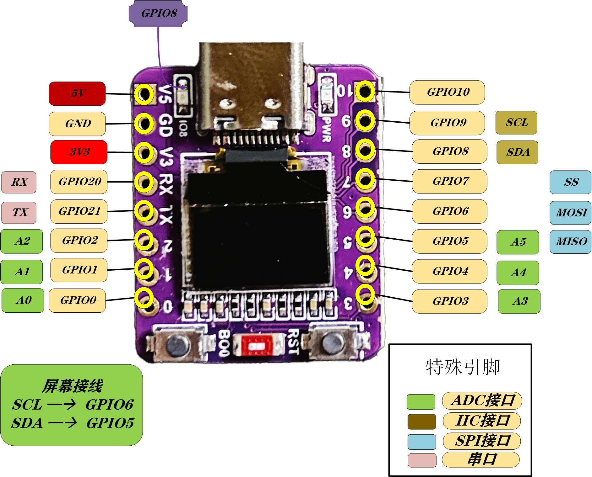
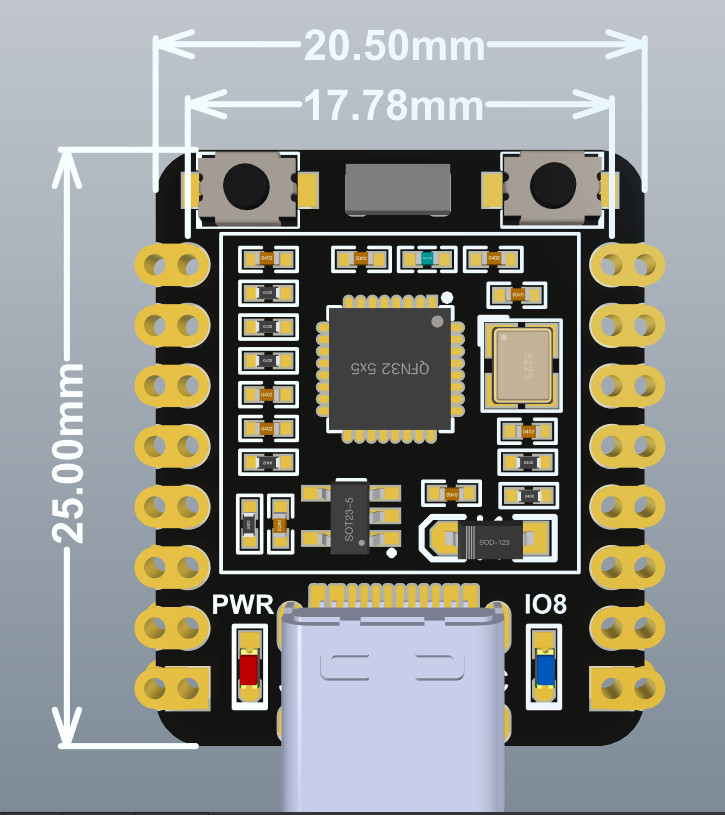
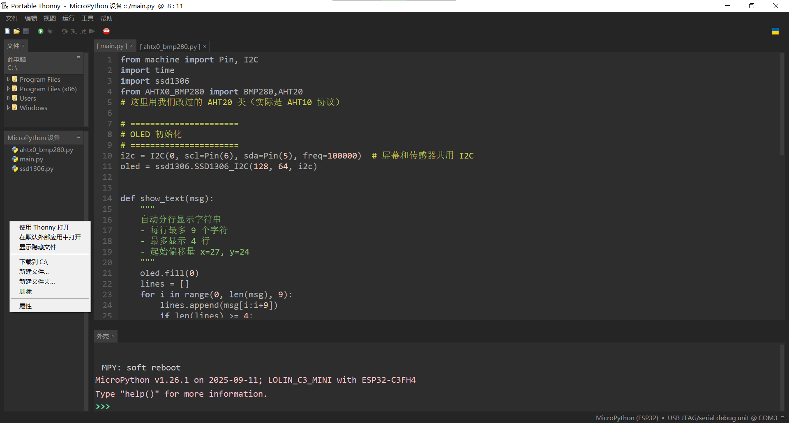
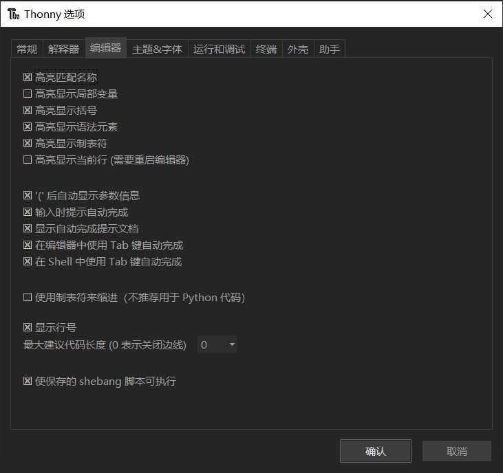
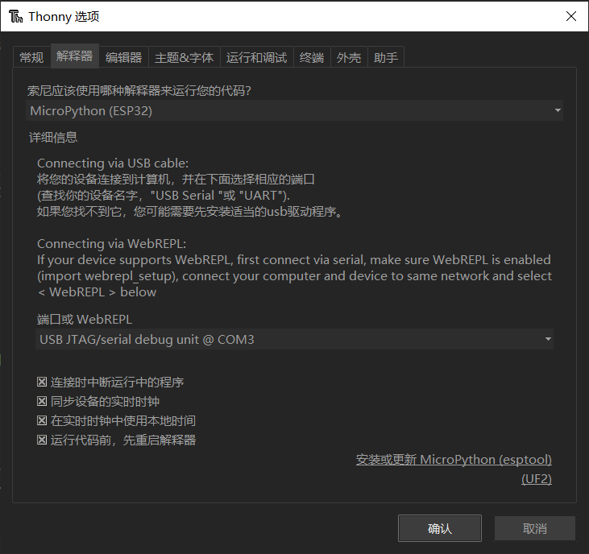
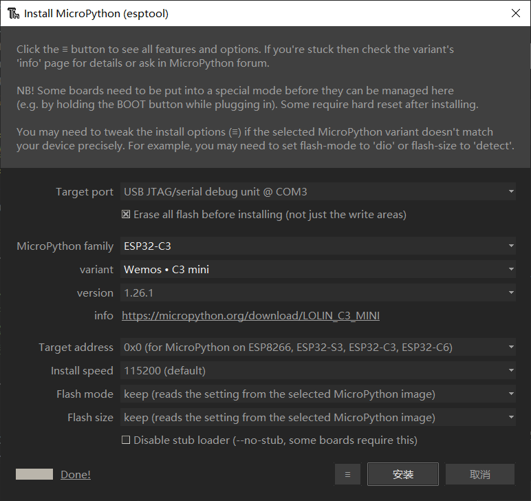
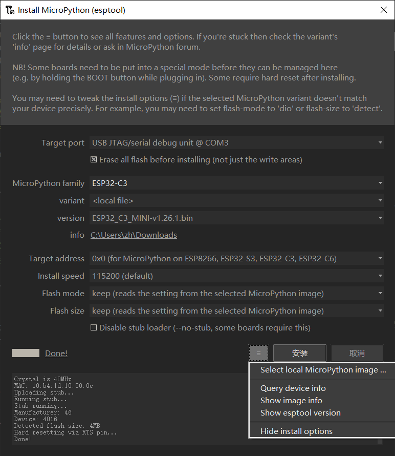

drivers：驱动文件，sources部分项目源代码，tools开发工具。

一、硬件说明

1. 单片机芯片型号是ESP32-C3FN4/FH4    内置4M flash，2.4Ghz WiFi+蓝牙5BLE不支持传统蓝牙(可以同时使用)。LED连接在GPIO8引脚。单片机有两组iIC引脚，OLED显示器在0组SDA=GPIO5,SCL=GPIO6。1组SDA=GPIO8,SCL=GPIO9

2. 自带的0.42 英寸 OLED 是一款具有 128x64 像素缓冲区和**显示 73 x 64 像素**的iIC通信协议显示器。IIC连接0组（SDA=GPIO5,SCL=GPIO6）屏幕X27Y24坐标位于RST按钮方向。使用 **SSD1306.py** 驱动程序

二、驱动文件drivers说明：

1. **SSD1306.py** 像素偏移量为：**x+27** 和 **y+24** ，可以显示 8 像素宽度 + 1 像素 = 73 像素的 9 个字符。字符集由 8x8 像素字符组成。行距 y = 10，字符每行 9 个 <= 4 行，是此驱动程序的最佳选择。
2. MicroPython-uFont此文件夹是屏幕显示汉字驱动，内部有文档此处不另外说明。
3. ahtx0_bmp280.py这个是AHT20+BMP280温湿度+气压传感器模块驱动。(AHT20实际芯片是AHT10)驱动内代码已做修改但依然保留原AHT20类名
4. st7735.py此文件是1.44寸spi接口屏幕的驱动暂时未使用过。  

三、项目源文件sources说明：

1. 蓝牙和WIFI.py蓝牙和WiFi同时启用，两个连接一个后自动关闭未连接的另外一个，如先连接蓝牙则自动关闭WiFi反之亦然。（此设备的蓝牙不可被手机直连，iPhone无法直接看到此设备的蓝牙）60秒无连接超时自动关闭连接以节能。需配合ssd1306.py驱动,项目会在屏幕输出信息
2. 测量温湿度和压力.py需配合ahtx0_bmp280.py+ssd1306.py一起使用,在屏幕上输出A:AHT的温度T湿度H和B:BMP的温度T大气压力P。默认接线SDA=GPIO5，SCL=GPIO6。

四、Thonny软件(tools)使用说明：

配置完成的thonny界面：可以直接在MicroPython设备里新建文件然后命名为xxx.py再把代码放进去然后保存运行即可，需要注意驱动也是放在这里而不是固件区。最好就是驱动按正常名称命名，要跑的项目命名为main.py然后在里面放项目代码。注意如果代码有死循环需要按一下单片机RST键再点左上角的红色stop键才能重新运行新代码。   

1. thonny可以直接解压压缩包使用，也可以安装exe程序，还可以用python -m pip install thonny然后命令行thonny启动。
2. 第一次Language选简体中文第二项不用改，然后左上角视图勾选上“文件”。工具/选项/编辑器 按照下图勾选即可。全选也可以不过需要重启编辑器。主题和字体推荐：UI主题选 Clean Dark，语法主题选Default Dark，编辑器主题和IO字体选Consolas，13号。

3. 配置完编辑器后配置解释器，按图片选择，端口那里每台电脑不一定相同按照它自动检测到的选即可。  

4. 接着这条很重要，这是烧录micro python固件的操作：  

   如果前面com连接上了则点击上图右下角的安装或更新MicroPython，然后点击安装左边的小按钮，第一项select····是选择本地下载好的离线micro python固件安装。第二项是查询设备信息，第三项是查询在线固件库信息，第四项是查询esptools版本信息。点第二项或第三项即可，按照下图方式勾选完点安装，Target port是选设备端口号，☒ Erase all flash···是擦除设备全部固件再下载新固件，micro python family是固件类型按单片机型号选即可（ESP32-C3）variant 设备详细版本（Wemos · C3 mini），version版本选最新即可，info是从哪个网站下载固件不需要改，Target address是固件起始路径选0x0 (for micropython on ···ESP32-C3···)，install speed安装速度选115200(default)，Flash mode闪存模式选keep (reads ··· image)，Flash size闪存大小选keep (reads ··· image)或者按本单片机容量4MB选4MB。最后这个不用管如果安装不成功可以勾选上试试。

   

5. 若在线安装不成功可尝试选择安装按钮旁边的三根横线然后选第一项选择./ESP32C3mini/tools/ESP32_C3_MINI-v1.26.1.bin这个离线固件然后按下图操作

   
